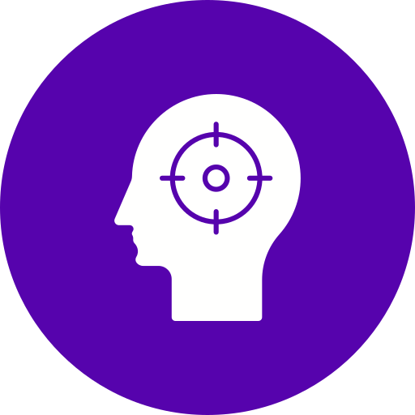

# FocusFrame - Plataforma de Gestión Psicológica

  

Plataforma integral para la gestión de citas, pacientes y historiales clínicos entre psicólogos y pacientes.

## Características Principales

### Para Psicólogos
- Gestión completa de pacientes
- Agenda de citas interactiva
- Creación de historiales clínicos

### Para Pacientes
- Solicitud de citas en línea
- Historial clínico accesible
- Comunicación segura con profesionales

## Tecnologías Utilizadas

- **Frontend**: 
  
  
  
  
  
- **Estilos**: 
  
  

